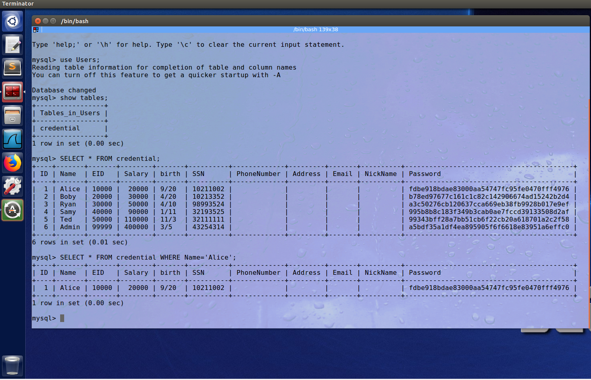

# Laboratório 3 - SQL Injection

## Tarefa 1 - Familiarizar com os comandos SQL

### Felipe Junio Rezende - 11711ECP007

### Murilo Guerreiro Badoco - 11711ECP010

O objetivo da primeira tarefa foi utilizar o banco de dados MySQL fornecido, e realizar alguns comandos para familiarizar com a ferramenta. Primeiramente, conectamos ao serviço de Banco de Dados MySQL executando o seguinte comando no terminal:

```bash
mysql -u root -pseedubuntu
```

Em seguida, inserimos alguns comandos para acessar o *schema* **Users**, mostrar todas as tabelas criadas e imprimir todos os dados da tabela **credential**:

```sql
use Users;
show tables;
SELECT * FROM credential;
```

Dessa maneira, verificamos que há um campo **Name** com o usuário Alice na tabela **credential**. Portanto, utilizamos o seguinte comando para selecionar todas as informações referentes à Alice:

```sql
SELECT * FROM credential WHERE Name='Alice';
```

Abaixo, podemos ver o resultado obtido ao executar a Query:



## Tarefa 2 - SQL Injection Attack sobre uma query SELECT

### **Tarefa 2.1 -** SQL Injection Attack por meio de uma página Web

Primeiro com o conhecimento do banco que está sendo utilizado e a query que está sendo feita conseguimos realizar uma query no banco finalizando o primeiro parâmetro Name na restrição WHERE passando uma aspas simples concatenado à admin, da seguinte maneira: **" admin' "** conseguimos encerrar antes do esperado o primeiro atributo. Além disso o carácter especial **"#"** também foi passado no username, pois por padrão é utilizado para comentários no MySQL. Por fim o comando fica da seguinte forma: `admin' #`, com isso o restante da query é comentado porém ainda assim apenas uma informação é recebida pelo banco e esta satisfaz a query que habilita a conexão.   


Ao clicar em *Login,* mesmo sem inserir uma senha, a página de administrador será acessada:


### **Tarefa 2.2 -** SQL Injection Attack por meio do terminal

O objetivo dessa tarefa foi repetir a anterior (2.1), porém sem usar a página Web. Ou seja, a requisição deve ser criada com o comando `$curl` pelo terminal, passando o **username** e **Password** como parâmetro da URL:

```bash
curl 'www.seedlabsqlinjection.com/unsafe_home.php?username=admin%27%23&Password='
```

Pode-se observar que o parâmetro **username** da URL foi codificado, para que não haja problema ao enviar a requisição. A seguir, é possível ver o HTML retornado pelo servidor:


### **Tarefa 2.3 -** Inserir múltiplos comandos SQL

 Para a terceira tarefa, foi requisitado por meio de uma Query a'; exclusão de um dado no Banco, ou seja, o *DELETE.* Para tal, no formulário de *login* da aplicação Web foi inserido o seguinte:

```sql
';DELETE FROM credential WHERE Name='Alice'; #
```

No resultado mostrado abaixo, pode-se concluir que não é possível fazer o DELETE no banco de dados, pois a aplicação tem uma contramedida para operações que alterem o banco de dados:


## Tarefa 3 - SQL Injection Attack sobre uma query UPDATE

A tarefa 3 consiste em utilizar o formulário da página de edição de perfil para executar uma Query SQL e modificar os dados desejados no Banco, mesmo que sejam dados inacessíveis pelo usuário da aplicação. Para isso, foi feito o *login* no perfil da Alice.

**Tarefa 3.1 -** Modificar o próprio salário. Para modificar o salário de Alice, foi preciso inserir no campo **NickName** o seguinte:

```sql
', salary=1000000 #
```

Após salvar as alterações, podemos observar que o salário de Alice foi aumentado:


### **Tarefa 3.2 -** Modificar o salário de outras pessoas

Assim como na tarefa 2.1, logamos no perfil administrador ao inserir `admin' #` no campo **username.** Dessa maneira, é possível obter as informações de todos os usuários cadastrados. 


Assim, utilizamos o valor inserido no campo **EId** de Boby para construir uma Query SQL que altera o seu salário, mesmo sem estar conectado em sua conta. Portanto, entramos na página de edição do perfil de Alice e inserimos no campo **NickName**:

```sql
b1', salary=1 WHERE EId=20000 #
```

Ao voltar no perfil admin, podemos verificar que o salário de Boby foi alterado com sucesso:


### **Tarefa 3.3 -** Modificar a senha de outras pessoas

Para modificar a senha de Boby, seguimos o mesmo procedimento. Porém, a senha deve ser criptografada de acordo com a função *hash* **SHA1**. Portanto, primeiro criptografamos a nova senha como mostrado a seguir:


Em seguida, copiamos a senha criptografada e construimos a seguinte Query SQL:

```sql
b', password='c7c8d1c458001c7c6d5f4e173c9eb75efb2a269f' WHERE EId=20000 #
```

Portanto, entramos novamente no perfil de Alice e inserimos o trecho acima no campo **NickName**. Após salvar as alterações, tentamos entrar no perfil de Boby inserindo a senha antiga `seedboby`. Podemos observar nos parâmetros da URL a senha informada, e que essa senha não funciona mais para acessar o perfil de Boby.


Ao tentar novamente utilizando a senha recém-criada `novasenha` , o perfil de Boby é acessado com sucesso:


## Tarefa 4 - Contramedida - Prepared Statement

O objetivo da última tarefa era modificar o código de autenticação do usuário, bem como o de edição de perfil. Para isso acessamos os arquivos *unsafe_home.php* e *unsafe_edit_backend.php* localizados no diretório *var/www/SQLInjection* e os modificamos, afim de corrigir as vulnerabilidades do SQL utilizando os Prepared Statements.

O código modificado em *unsafe_home.php* ficou assim:

```php
$sql = $conn->prepare("SELECT id, name, eid, salary, birth, ssn, phoneNumber, address, email,nickname,Password
      FROM credential
      WHERE name= ? and Password= ?");
      $sql->bind_param("ss", $input_uname, $hashed_pwd);
      $sql->execute();
      $sql->bind_result($id, $name, $eid, $salary, $birth, $ssn, $phoneNumber, $address, $email, $nickname, $pwd);
      $sql->fetch();
      $sql->close();
```

O código modificado em *unsafe_edit_backend.php* ficou assim:

```php
$sql = $conn->prepare("UPDATE credential SET nickname= ?,email= ?,address= ?,Password= ?,PhoneNumber= ? where ID=$id;");
    $sql->bind_param("sssss",$input_nickname,$input_email,$input_address,$hashed_pwd,$input_phonenumber);
    $sql->execute();
    $sql->close();
  }else{
    // if passowrd field is empty.
    $sql = $conn->prepare("UPDATE credential SET nickname=?,email=?,address=?,PhoneNumber=? where ID=$id;");
    $sql->bind_param("ssss",$input_nickname,$input_email,$input_address,$input_phonenumber);
    $sql->execute();
    $sql->close();
  }
```

Ao tentar realizar o ataque novamente, pode-se concluir que não é possível acessar a aplicação por meio de SQL Injection, e a contramedida funcionou corretamente:


